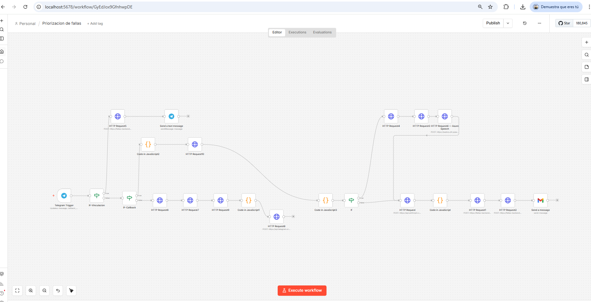
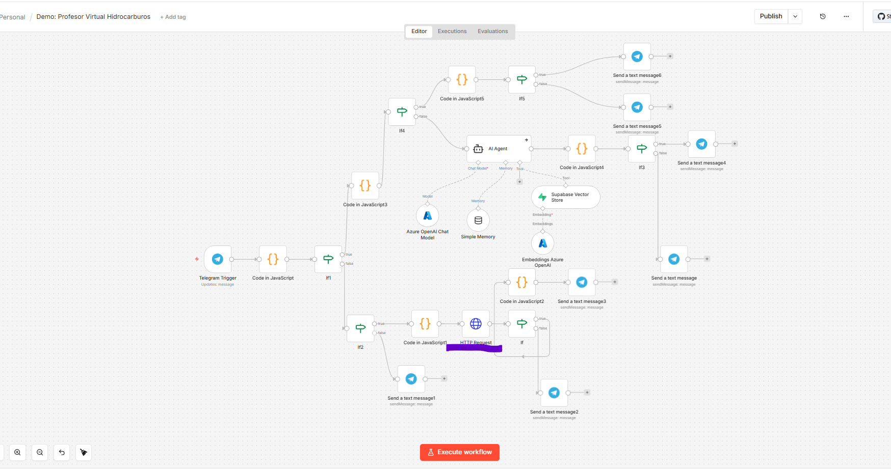

# 🚀 Enterprise Automation & AI Orchestration Showcase

Este repositorio contiene arquitecturas de automatización de misión crítica diseñadas para optimizar procesos operativos industriales mediante **n8n**.

## 🛠️ Proyectos Destacados

### 1. Sistema de Priorización de Fallas Críticas
**Descripción:** Flujo automatizado para la gestión de incidencias en tiempo real.
* **IA & Voz:** Procesamiento de notas de voz mediante **Azure Speech Services**.
* **Lógica:** Validación de condiciones complejas y consumo de APIs externas.

### 2. Asistente Virtual RAG (Sector Hidrocarburos)
**Descripción:** Implementación de un sistema de respuesta inteligente basado en documentos técnicos.
* **IA:** Agentes de **Azure OpenAI** con memoria persistente.
* **Vectores:** Búsqueda semántica utilizando **Supabase (pgvector)**.

---
**Senior Solution Architect** | Especialista en .NET, Azure e Inteligencia Artificial.
